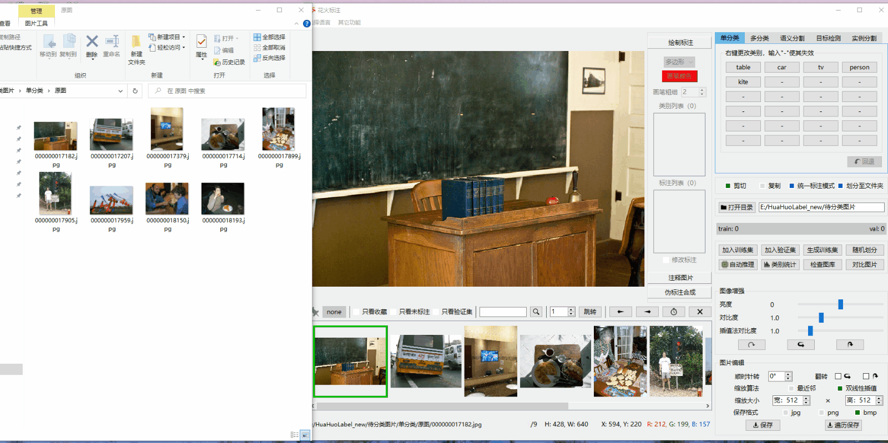

<div align=center>
  
</div>

## [===> English README.md](README_EN.md)  

## 花火标注  
<div align=center>
  
</div>


**花火标注**是一个纯Python项目，由[PySide6](https://doc.qt.io/qtforpython-6/)开发、并用[Nuitka](https://github.com/Nuitka/Nuitka)打包。
它是一款多功能的AI数据标注工具，支持单类别分类、多类别分类、语义分割、目标检测和实例分割共5个计算机视觉任务的数据标注。
花火标注还具有图片编辑、标注图库管理、自动标注、伪标注生成等功能，帮助您更方便得训练AI模型。

## 支持的系统
Windows10（已测试），Windows11（未测试）  
Ubuntu20.04（已测试），Ubuntu22.04（已测试）

## 支持的语言
中文简体，English

## 亮点功能
* 良好的用户界面和完善的操作方法  

|                         单类别分类                          |                          实例分割                          |
|:------------------------------------------------------:|:------------------------------------------------------:|
|  |  |

* 环形和像素标注  

|                   环形标注                   |                    像素标注                    |
|:----------------------------------------:|:------------------------------------------:|
|  |  |

* 实时图像增强  
  

* 标注统计与管理  
 

* 划分训练集和验证集  
 

* 自动标注  
（待完成）

* 伪标注生成  
（待完成）

## 使用方法
[花火标注全功能介绍](USAGE_CN.md)

## 打包项目
该项目使用nuitka打包，nuitka支持Windows、Linux、MacOS，理论上使用源代码均能打包成适配系统的执行程序。
```Shell
# 安装nuitka
pip install nuitka
# Windows系统
python -m nuitka --mingw64 --standalone --plugin-enable=pyside6 --output-dir=out  --windows-disable-console --windows-icon-from-ico=images/icon.png HHL.py
# Ubuntu系统
# 由于（https://nuitka.net/info/debian-dist-packages.html），请使用pip管理python包。
# 安装patchelf
sudo apt install patchelf
python -m nuitka --standalone --plugin-enable=pyside6 --output-dir=out  --windows-disable-console --windows-icon-from-ico=images/icon.png HHL.py
```
打包完成后，将images文件夹、ts_files文件夹、ui_files文件夹、project.json文件拷贝到软件根目录下。

## 帮助项目
1. 如果你熟悉PySide6，这些问题或许可以帮到作者。  
https://forum.qt.io/topic/141592/can-not-move-horizontalscrollbar-to-the-rightmost-side
https://forum.qt.io/topic/141742/how-to-translate-text-with-quiloader

2. 作者英文水平有限，软件英文版的翻译以及[USAGE_EN.md](USAGE_EN.md)的翻译需要您的宝贵意见。  

## License  
花火标注采用GNU GPL许可证，您可以随意使用该工具，但在未取得作者许可的情况下，请勿使用该软件进行商业行为。  
