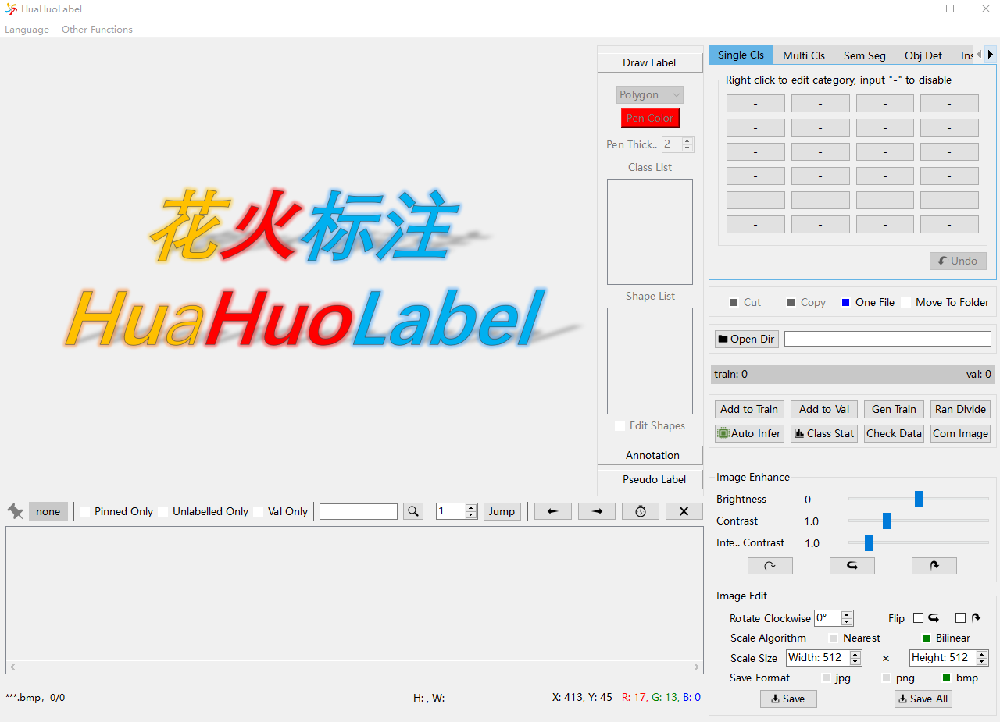
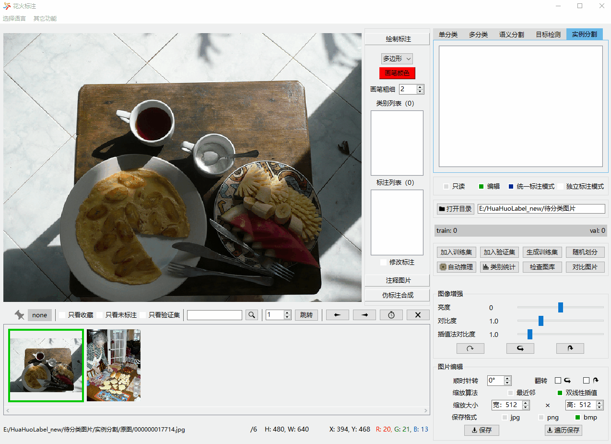
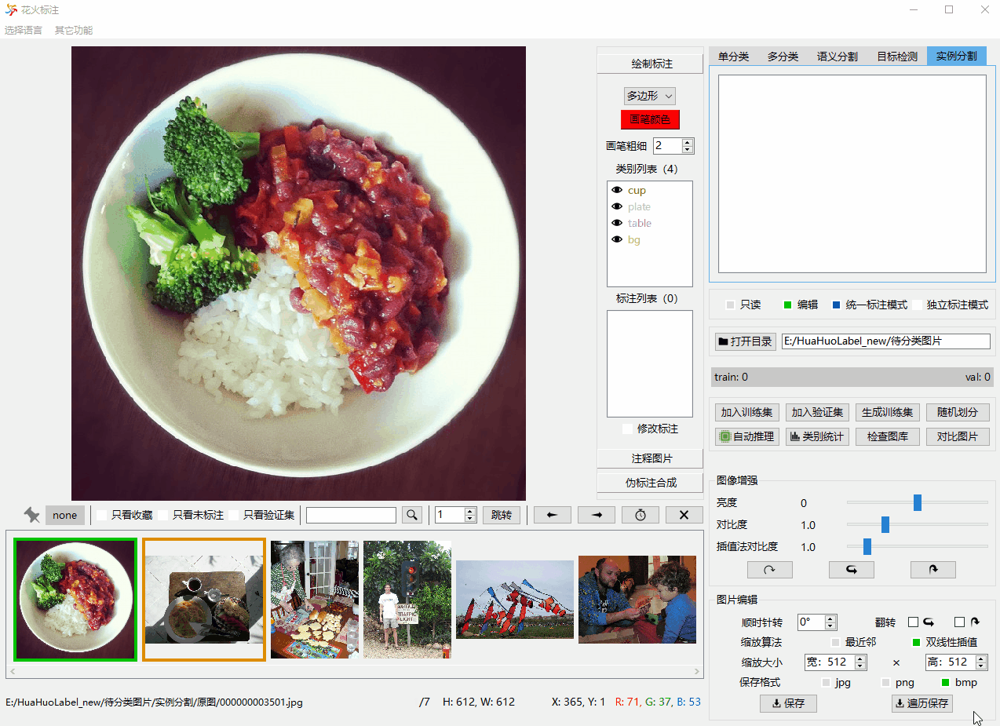
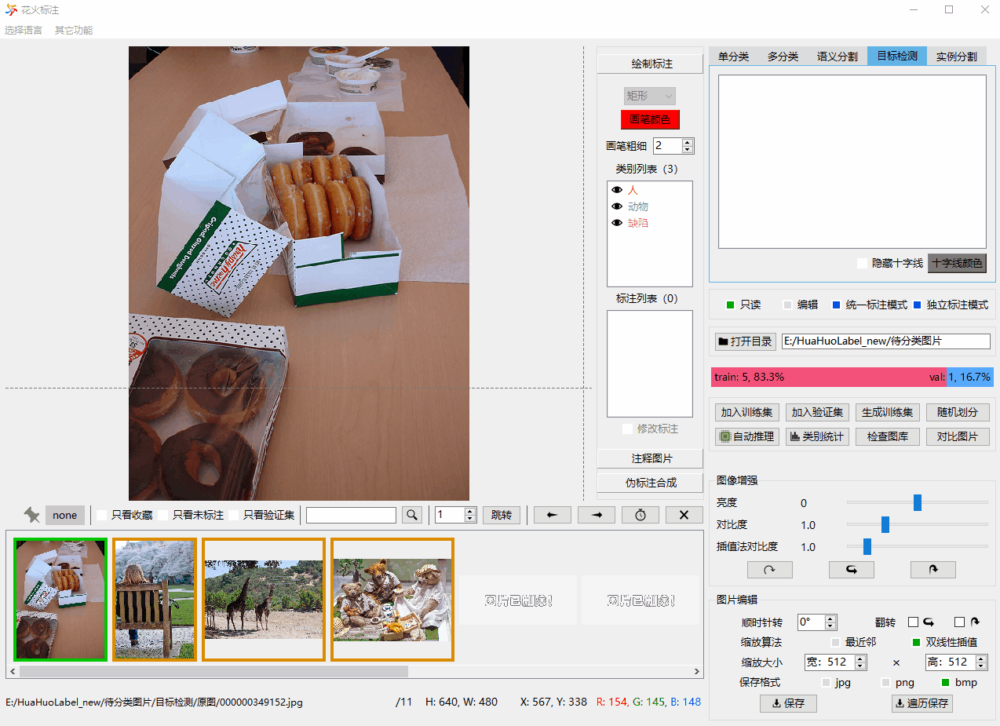

<div align=center>
  
</div>

## HuaHuoLabel 
<div align=center>
  
</div>

**HuaHuoLabel** is a pure Python project. It is developed with [PySide6](https://doc.qt.io/qtforpython-6/) and compiled with [Nuitka](https://github.com/Nuitka/Nuitka).
It is a multifunctional AI data label tool, which supports data label of five computer vision tasks, including single-category classification, multi-category classification, semantic segmentation, object detection and instance segmentation.
HuaHuoLabel can also do image editing, dataset management, auto-labeling, and pseudo label generation, which can help train AI models more conveniently.

## Support OS
Windows10 (tested), Windows11 (untested)   
Ubuntu20.04 (tested), Ubuntu22.04 (tested)  

## Support Language
中文简体, English

## Highlights
* Good user interface and operation method

|             Single Category Classification             |                 Instance Segmentation                  |
|:------------------------------------------------------:|:------------------------------------------------------:|
|  |  |

* Ring form and pixel-level label 

|             Ring form label              |             Pixel-level label              |
|:----------------------------------------:|:------------------------------------------:|
|  |  |

* Real-time image enhancement   
  


* Label statistics and management  
 


* Divide train set and validation set  
 


* Auto-labeling  
（to be done）


* Pseudo label generation  
（to be done）

## Usage
[HuaHuoLabel usage introduction](USAGE_EN.md)

## Run Project
1. Download the [release](https://github.com/feiyuhuahuo/HuaHuoLabel/releases/tag/V1.0.0)  
Unzip the file, for Windows version, directly run the HHL.exe.  
For Ubuntu version:
    ```
    cd HHL.dist
    ./HHL.bin
    ```

2. Clone the source code and then compile it  
This project is compiled with Nuitka. Nuitka supports Windows、Linux and macOS. Theoretically, the source code can be compiled to the execution program for all the adaptive systems.

    ```Shell
    # install nuitka
    pip install nuitka
    # For Windows
    python -m nuitka --mingw64 --standalone --plugin-enable=pyside6 --nofollow-import-to=tkinter --output-dir=out --windows-disable-console --windows-icon-from-ico=images/icon.png HHL.py
    # For Ubuntu
    # Because of (https://nuitka.net/info/debian-dist-packages.html), please use pip to manage python packages.
    # install patchelf, ccache
    sudo apt install patchelf ccache
    python -m nuitka --standalone --plugin-enable=pyside6 --output-dir=out --windows-disable-console --windows-icon-from-ico=images/icon.png HHL.py
    ```
    After compilation is done, copy "images" folder, "ts_files" folder, "ui_files" folder and "project.json" to the project root directory.

3. Clone the source code and run [HHL.py](HHL.py) in your IDE.


## Something Need Help  
1. If you are familiar with PySide6, these problems need help.   
https://forum.qt.io/topic/141592/can-not-move-horizontalscrollbar-to-the-rightmost-side  
https://forum.qt.io/topic/141742/how-to-translate-text-with-quiloader

2. Due to the author's limited English, any suggestion of the translation of the English version release and [USAGE_EN.md](USAGE_EN.md) is welcome.

## License  
HuaHuoLabel uses GNU GPL license. You can use this tool at will. However, do not use it for commercial activities without the permission of the author.  
