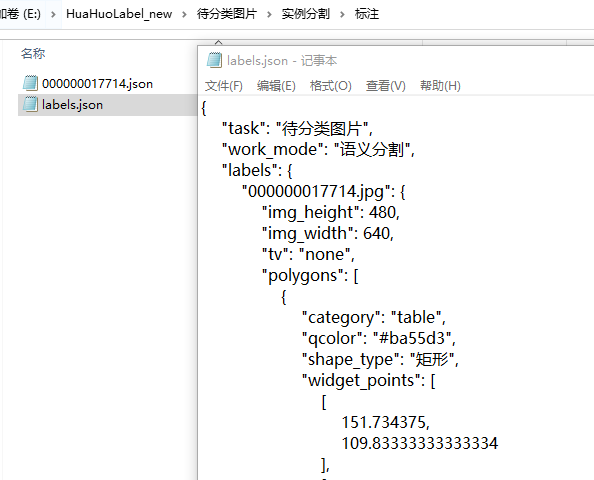
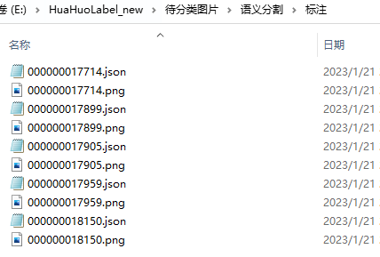
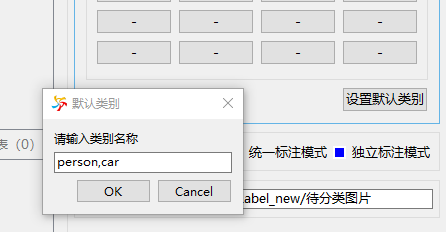
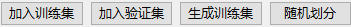
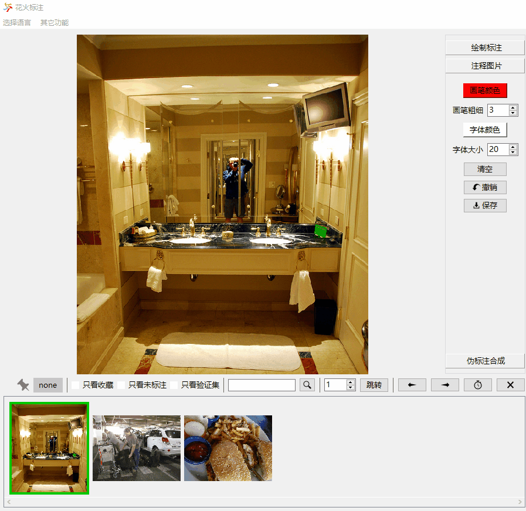
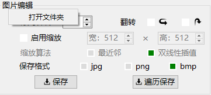

## 建立任务
目录结构：  
```
└─根目录
    ├─deleted
    └─目标检测（单分类、语义分割...）
        ├─imgs（仅独立标注模式）
        │  ├─train
        │  └─val
        ├─labels（仅独立标注模式）
        │  ├─train
        │  └─val
        ├─原图
        └─标注
```
选择一个根目录，在根目录下手动新建一个"目标检测"（或"单分类"、"多分类"、"语义分割"、"实例分割"）文件夹，
之后在该目录下新建"原图"文件夹，将待标注的图片拷贝到该文件夹下，之后在软件中点击"打开目录"按钮，并选择**根目录文件夹**。

## 标注模式
* 统一标注模式（推荐）    
  
统一标注模式由一个统一的"labels.json"来记录所有标注信息，图片未标注时，该图片名称不会出现在该json文件中，任何对标注的修改都会修改该文件，可以使用[scripts/parse_json.py](scripts/parse_json.py)来解析该文件。
在"编辑"模式下，"labels.json"会在"打开目录"、"切换任务类型"、"关闭软件"时自动保存，每隔5min也会自动保存一次。  


* 独立标注模式  
   
独立标注模式下，每张图片都有对应的一个或多个文件来记录标注信息，图片未标注时，该图片不会有对应的标注文件。划分数据集时，会产生额外的imgs和labels文件夹来分别保存训练集和验证集。
任何对标注的修改都会同时修改"标注"文件夹和"labels"文件夹里的标注文件。在"编辑"模式下，切图时标注文件会自动保存。


* 统一标注模式 + 独立标注模式（不推荐）  
两个标注模式可以同时生效，同时产生"labels.json"和对应每张图片的独立标注文件，但软件界面与标注相关的信息都优先根据"labels.json"记录的信息来显示。在该模式下，请严格使用软件来进行标注操作，以免标注文件冲突、混乱。


## 界面操作

1. 图片展示区域：鼠标左键单击拖动图片，双击铺开图片，右键弹出菜单，滚轮缩放图片  
2.   
从左到右依次为：指示当前图片是否已收藏，指示当前图片属于训练集还是验证集，浏览图片时只浏览收藏（未标注、验证集）的图片，搜索并跳转至某一图片，跳转至某一索引的图片，浏览上一张（下一张）图片，设置切图的延时，删除当前图片。  

## 标注操作
* 加载类别、导出类别  
对于单类别分类和多类别分类，在按钮组的右键菜单里可以加载类别和导出类别。对于语义分割、目标检测和实例分割，在类别列表里的右键菜单里可以加载类别和导出类别。

* 单类别分类  
在按钮上右键输入类别，输入"-"使其失效，左键单击将图片分类到对应类别。    
在统一标注模式下，单独的类别文件夹不会被创建。  
在独立标注模式下，单独的类别文件夹会被创建，图片会被剪切（复制）到对应类别文件夹下，可以使用"回退"按钮来撤销图片移动操作。  

* 多类别分类  
  
在按钮上右键输入类别，输入"-"使其失效，左键单击将图片分类到对应类别，一张图片可以存在多个类别。可以使用"设置默认类别"按钮来设置若干个默认类别，此时若图片不由类别按钮指定类别，则标注类别为默认类别。  


* 语义分割、目标检测、实例分割  

1. 绘制标注
按住Ctrl+鼠标左键单击可以绘制多边形、矩形、椭圆和环形，绘制环形需要依次绘制目标的外轮廓和内轮廓，Ctrl+Z可以撤销一个点。按住Ctrl+拖动鼠标左键可以绘制像素标注。  
2. 修改标注  
激活"修改标注"按钮，鼠标悬浮在标注上方可以选定标注，有时小标注会被大标注遮盖而无法选定，此时可在标注列表右键并使用"锁定标注"功能来锁定某个标注。拖动鼠标左键（或使用快捷键W、S、A、D）可以移动标注。鼠标靠近某个角点可以拖动修改角点坐标。修改像素标注时，按住Shift+鼠标左键单击可以添加或删除一个像素点。  
3. 复制标注  
在右键菜单中，可以通过"收藏标注"和"绘制收藏的标注"按钮来快速复制一个已完成的标注。  
4. 显示标注图  
在下方缩略图区域，左键单击可以显示原图，右键单击可以显示标注图。  
5. 语义分割  
标注语义分割任务时，可以通过"标注为背景"按钮将一张未标注的图片标注为纯背景。此外在独立标注模式下，由于生成的PNG标注和类别列表的顺序和数量强相关，因此当类别列表发生变化时，可能需要通过"更新所有PNG"按钮来更新以往的PNG标注。  
6. 目标检测  
标注目标检测任务时，图形限定为矩形，记录的坐标为矩形的左上角坐标和右下角坐标。  
7. 实例分割  
标注实例分割任务时，解析json文件的方法可以参照[scripts/parse_json.py](scripts/parse_json.py)


## 划分数据集


使用这几个按钮来将数据集划分为训练集和验证集，独立标注模式下，会生成额外的imgs和labels文件夹。

## 图片注释
  
图片注释会直接修改图片像素，按住Ctrl+拖动鼠标左键可以绘制轨迹，按住Ctrl+双击鼠标左键可以输入文字。

## 图片收藏
  

可以通过该按钮来收藏一张图片，收藏的图片通过"pinned_images.json"来记录。

## 图片编辑
   

可以在图片编辑区域右键并打开一个文件夹，然后根据设置保存编辑后的图片。

## 自动标注
（待完成）

## 伪标注生成
（待完成）
