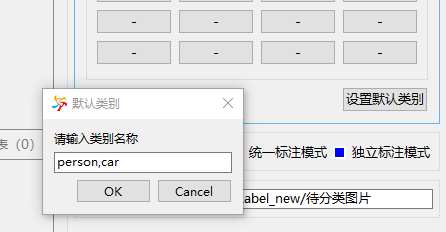
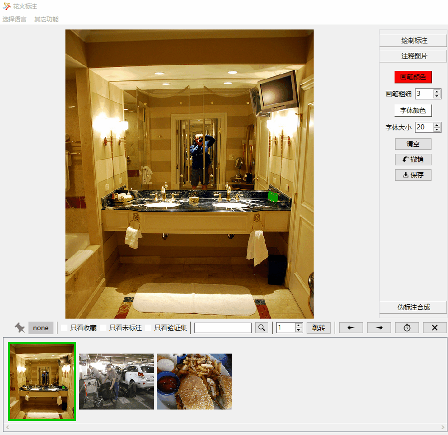

## Build Task
Directory structure: 
```
└─root directory
    ├─deleted
    └─Obj Det(Single Cls、Sem Seg...)
        ├─imgs (Separate mode only)
        │  ├─train
        │  └─val
        ├─labels (Separate mode only)
        │  ├─train
        │  └─val
        ├─Original Images
        └─Label Files
```
Select a root directory and manually create an "Obj Det" (or "Single Cls", "Multi Cls", "Sem Seg", "Ins Seg") folder under it.
Then create an "Original Images" folder under the directory, copy the images to be labeled into the folder, click the "Open Dir" button in the software, and then select the **root directory**.

## Label Mode
* One File mode (recommended)   
   
In One File Mode, all label information is recorded by a unified "labels.json". When the image is not labeled, the image name will not appear in the json file. Any modification to the label will modify the file. You can use [scripts/parse_json.py](../scripts/parse_json.py) to parse the file.
In "Write" mode, "labels.json" will be automatically saved when you "open directory", "switch task type" and "close software". It will also be saved every 5 minutes.


* Separate File mode  
  
In Separate File Mode, each image has one or more corresponding files to record the label information. If the image is not labeled, there is no corresponding label file. When dividing dataset, two additional folders: "imgs" and "labels" folders will be generated to save train set and validation set respectively.
Any modification to the label will modify the file in the "Label Files" folder and the "labels" folder at the same time. In "Write mode", the label file will be saved automatically when switch image.


* One File mode + Separate File mode (not recommended)   
The two modes can work at the same time. "labels.json" and the additional label file corresponding to each image are genearted at the same time. However, the label information showed in the software interface is according to "labels.json". In this mode, please strictly use the software to label your images and avoid label file conflict and confusion.

## UI Operation
1. Image display area: left-click to drag the image, double-click to maximize  the image, right-click to pop up the menu, and scroll to zoom the image.  

2.   
From left to right: whether the current image has been collected; whether the current image belongs to the train set or the validation set; only browse the collected (unlabelled, validation set) images; search and jump to a certain image; jump to the indexed image; go to the previous (next) image; set the browse delay; delete the current image.

## Label Operation
* Load and export classes  
For Single Cls and Multi Cls, you can load and export classes in the right-click menu of the button group. For Sem Seg, Obj Det and Ins Seg, you can load and export classes in the right-click menu of the class list.


* Single Cls  
Right-click the button to input a category, input "-" to disable it. Left-click to classify the image into the corresponding category.
In One File mode, additional category folders will not be created.
In Separate File mode, additional category folders will be created. Images will be cut (copied) to the corresponding category folder. You can use the "Undo" button to undo the image movement operation.  


* Multi Cls  
  
Right-click the button to input a category, input "-" to disable it. Left-click to classify the image into the corresponding category. Multiple categories can be assigned to the same image. You can use the "Set Default Category" button to set several default categories. If so, if no category is assigned to a certain image, the image category is set as these default categories. 


* Sem Seg, Obj Det, Ins Seg  
  
1. Draw a shape  
Hold down Ctrl and click the left mouse button to draw polygons, rectangles, ellipses and rings. To draw rings, you need to draw the outer contour and inner contour of the object in turn. Press Ctrl+Z to undo a point. Hold down Ctrl and drag the left mouse button to draw pixel-level label.   
2. Modify a shape   
Enable the "Edit Shapes" button, hover the cursor over a shape to select it. Sometimes the small shape will be covered by a large shape and thus cannot be selected. For this case, you can right-click in the "Shape List" and use the "Lock Shape" function to lock a shape. Drag the left mouse button (or use the shortcut keys W, S, A, D) to move the shape. Use "Delete" to delete a shape. When the cursor is close to a shape corner, you can drag to modify the corner coordinates. When modifying pixel label, hold down Shift and click left mouse button to add or remove a pixel.  
3. Duplicate a shape  
In the right-click menu, you can quickly duplicate a completed shape through the "Collect" and "Draw Collected Shapes" options.   
4. Show label image   
In the lower thumbnail area, left click to display the original image and right click to display the label image.  
5. Sem Seg  
When doing semantic segmentation tasks, you can mark an unlabelled image as a pure background label by clicking the "As Background" button. In addition, in Separate File mode, since the generated PNG labels are strongly related to the order and quantity of the class list, when the class list changes, you may need to update the previous PNG labels through the "Update All PNGs" button.  
6. Obj Det  
When doing object detection tasks, the shape is limited to "rectangle". The recorded coordinates are the coordinates of the upper left corner and the lower right corner of the rectangle.
7. Ins Seg  
When doing instance segmentation tasks, to parse json files, you can consult [scripts/parse_json.py](../scripts/parse_json.py).


## Divide Dataset  
  

In "Write" mode, use these buttons to divide the dataset into train set and validation set. In Separate File mode, additional "imgs" and "labels" folders will be generated.

## Annotate Image  
  
Annotating image will directly modify the pixel value. Hold down Ctrl and drag the left mouse button to draw the trail. Hold down Ctrl and double-click the left mouse button to input text.

## Collect Image  


Use this button to collect an image. The collected images are recorded through "pinned_images.json".  

## Edit Image  
   

You can right-click in the "Image Edit" area and open a folder. Images can be saved according to the settings.

## Auto-labeling  
（to be done）

## Pseudo Label Generation  
（to be done）
